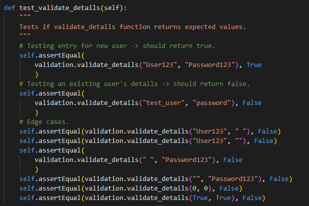
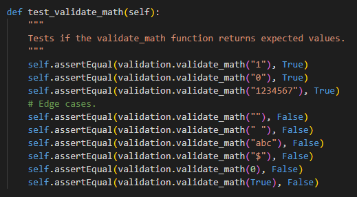

# **Dungeon Escape**
Developed by Jeremy Simons

[Link to live site](https://dungeonescape.herokuapp.com/)

## Introduction
Dungeon escape is a maze-solving game which also tests the user's multiplication skills. The objective of the game is to complete all 10 levels (mazes) without making more than 2 mistakes, in order to escape the dungeon!. 

After each level, the user must answer a multiplication question to progress to the next round. Any wrong move or incorrect answer will cost the user a life!

If the user loses all three lives, the game will be over and they will have to start from the beginning.

Users can sign up and complete the game, trying to get the highest score possible which is recorded in a google spreadsheet. This allows potential groups of users to play the game on their own devices and compete to see who gets the highest score.

## Contents
* [Project Goals](#project-goals) 
    * [For the user](#for-the-user)
    * [For the site owner](#for-the-site-owner)
* [User Experience](#user-experience) 
    * [Target audience](#target-audience)
    * [User requirements](#user-requirements)
    * [User Stories](#user-stories)
* [Technical Design](#technical-design)
    * [Data Models](#data-models)
    * [Flowchart](#flowchart)
* [Features](#features)
    * [Feature Ideas for future development](#feature-ideas-for-future-development)
* [Technologies Used](#technologies-used)
* [Deployment & Local Development](#deployment--local-development)
* [Testing](#testing)
    * [Validation](#validation)
    * [Manual Testing](#manual-testing)
    * [Automated Testing](#automated-testing)
    * [Bugs](#bugs)
* [Credits](#credits)

## Project Goals

### ...For the user
* Play a maze puzzle game and see how many points are earned
* To understand the instructions/how to play
* To sign up with a new account.
* Log back in to an existing account.

### ...For the site owner
* To provide users with all instructions on how to play the game.
* To make sure any user errors are handled and communicated back to the user.
* To receive feedback from the user about the game.

## User Experience

### Target audience
There are no specific users for the site, but the game would suit young users who are learning their times tables in school and need to practise them.

The game would also suit older users who want to refresh their mental arithmetic skills.

### User requirements
* A game that is understandable and works as expected.
* Log-in works as expected and incorrect details do not allow the user access to their account.
* User can quit the game when they want.
* Game score is communicated clearly back to the user.

### User Stories
#### As a first time user...
(1) Sign up with a username and for the game.
(2) Have instructions on how to play the game before starting.
(3) To have a visual representation of the dungeon where my in-game character is trapped.
(4) For inputs (whether text or numerical) to work as expected and any erroneous inputs to be flagged by the program
(5) For the program to give me feedback when I answer game questions correctly or incorrectly.
(6) To receive a score at the end of the game that gets saved by the program in case the user returns to the game to play again.

#### As a returning user... 
(7) Be able to log in with my username and password to beat previous scores.
(8) To skip the instructions because the user is already familiar with them.
(9) Play a game that is not exactly identical to the last time it was played, e.g. questions and dungeon rooms are randomly generated.
(10) To send feedback to the site owner about the game.

#### As the site owner...
(11) Ensure that all data entered by the user is validated so as not to break the program/create bad user experience.
(12) Ensure that all user actions are given feedback in the terminal so that users feel they know what to do next in the game.
(13) To test users’ ability to solve simple arithmetic problems.
(14) To get feedback from the users about how they found the game when they finish the game (either due to failing or completing).

## Technical Design

### Flowchart

A flowchart was created using [Lucidchart](https://lucid.app/) to visualise the logic flow of the game.

    
Flowchart

    
Dungeon Escape game logic:

    

### Data Models

* Two Classes were used to represent each **level** and each new **player**.
    * This allowed attributes to be preset as and when they were needed, such as level design data.
* Dictionaries were used to store user data.
    * This helped to verify user input when signing up to the game as the dictionary of players could be iterated through to prevent usernames getting duplicated.
* Nested Lists were used to represent the levels, as well as groups of data that are returned to functions. 
    * This data model worked best because the level could be sliced/changed/iterated through at multiple levels of abstraction.
* The Google Sheets API was used for user data and user feedback submissions.
    * This allows user data to persist beyond their browser session and allows the site owner to view any user feedback so that changes/improvements can be made to the game.

## Features
The website has a single page with several features within the mock python terminal. These features are listed below:

    
Game Title

    
This is what the user sees upon loading the site. The title text appears with a simple animation for visual appeal. There is also a login/signup feature here.

    <ul>
        <li>
            
Sign up y/n

        </li>
        <li>
            
User story covered:

            
        </li>
        <li>
            
Results of their calculation and recommendations that are generated based on the user's inputs

        </li>
        <li>
            
User story covered: 8

            
        </li>
        <li>
            
Button to print the user's personalised results section, with a pop up notification to warn the user that this action will also reset the form.

        </li>
        <li>
            
User story covered: 6, 9

            
        </li>
    </ul>

 

### Feature ideas for future development
In future the website could be further developed and improved to offer more
game rules and greater complexity in the levels. Some ideas include:
* A counter to measure how many moves it takes the user to complete each level and reward them for passing the level in the fewest steps possible.
* Add other symbols in the levels that trigger different events for extra (optional) bonus points. This would reward players who take greater risks in extending the amount of time navigating and potentially losing lives.
* Alter the score saving system so that the user's score is only saved if it is higher than the one stored in the spreadsheet.
## Technologies Used
### Languages used
Python

### Other tools/websites/libraries used
* [Lucidchart](https://lucid.app/) was used to create wireframes.
* [Git](https://git-scm.com/) was used for version control.
* [GitHub](https://github.com/) was used for saving and storing files.
* [GitPod](https://gitpod.io/) was the IDE used for writing and editing code.
* [Heroku](https://id.heroku.com/) was used as the hosting platform for this site.
* [Ascii art generator](http://patorjk.com/software/taag/#p=display&f=Varsity&t=Dungeon%0AEscape) was used to generate title text. Varsity font was used.
* [amiresponsive](https://ui.dev/amiresponsive?url=https://jeremyhsimons.github.io/CI_PP2_SavvySaver/) was used to test the website across different screens and generate the picture in the [Design](#design) section.

#### 3rd party Python Libraries used
* [Gspread / Google Sheets API](https://github.com/burnash/gspread)
* [Google OAuth 2.0](https://ui.dev/amiresponsive?url=https://dungeonescape.herokuapp.com/)
* [Colorama](https://pypi.org/project/colorama/)

## Deployment & Local Development
The website was deployed to [Heroku](https://id.heroku.com/) using the following process:
1. Login or create an account at [Heroku](https://dashboard.heroku.com/)
1. Click on New > Create new app in the top right of the screen.
1. Add an app name and select location, then click 'create app'.
1. Under the deploy tab of the next page, select connect to GitHub
1. Log in to your GitHub account when prompted.
1. Select the repository that you want to be connected to the Heroku app.
1. Click on the settings tab.
1. Scroll down to the config vars section, and add 2 config vars:
    * The first key is CREDS and the value here is the creds.json file that was generated for the google sheets API to work properly.
    * The second key is PORT and the Value is 8000
1. Once you have set up the config vars, scroll down to buildpacks (still under the settings tab)
1. Add the Python and Node.js buildpacks to your app and make sure that when they are displayed, they appear in the order:
    * Python
    * Node.JS
1. Navigate back to the settings tab.
1. Select automatic deploys to allow Heroku to build the site with new changes each time changes are pushed to GitHub.
1. In the 'manual deploy' section beneath this, make sure the branch selected is 'main' and click deploy branch.
1. The site should now be built and Heroku should provide a url for the built site.

This repository can be forked using the following process:
1. On the repository's page, go to the top-right of the page underneath the dark ribbon.
1. Click on the fork button
1. You can now work on a fork of this project. 

This repository can be cloned using the following process:
1. Go to this repository's page on GitHub.
1. Click on the code button (not the one in the navbar, but the one right above the file list).
1. Select an option, HTTPS, SSH, GitHub CLI.
1. Copy the url below to your clipboard.
1. Open Git Bash/your IDE terminal.
1. Ensure the directory you are working in is the correct one you want to paste the project into.
1. Type the command '$ git clone'
1. Paste the URL of the repository after this.
1. Hit enter on your keyboard and the project will be cloned.
 
## Testing
### Debugging
The site was tested using the following browsers: 
* Google Chrome
* Mozilla Firefox
* Microsoft Edge

The site was tested on the following devices:
* Lenovo Ideapad 520S (Windows 10)
* Huawei PSmart 2019 (EMUI version 12.0.0)

### Validation
#### PEP8 Python Validator (from Code Institute)
Code institute's own Python Linter [pep8](https://pep8ci.herokuapp.com/) was used to validate all Python code in this project.

All code passed with no errors apart from the run.py file where the line limit of 80 characters had to be exceeded to display the title. These were the only errors that were found in this file.

instructions.py

run_game.py

run.py

sheet_data.py

test_validation.py

validation.py

 

### Manual Testing

|User story|Feature|Test|Expected Result|Actual Result|
|---|---|---|---|---|
| 1. Navigate main features | Navigation bar | Starting at home page navigate to about page and reviews page. | Navigation elements lead to the expected pages. | Works as expected. |

    
Screenshots

     
     
     
     
     
     
    

 

### Automated Testing
Seven unit tests were written for this project. The test check that the validation functions (used to check user inputs) return the expected results.

For each unit test, the assertions test:
* Valid data
* Invalid data and edge cases.

    
Screenshots

    
All tests passed OK.

    
    
1. Test validate_yes_no

    
    
2. Test validate_details

    
    
3. Test validate_main_menu

    
    
4. Test validate_math

    
    
5. Test validate_navigation

    
    
6. Test validate_string

    
The test originally failed because there was no handling in the validation for non-string data types. Extra code had to be added to check for this in order for this test to pass.

    
    
7. Test validate_message

    
This test originally failed because checks for empty strings or spaces had been omitted. Once this had been added to the validation function, the test passed.

    

 

### Bugs

| Bug Description  | Action Taken to Fix  |
|---|---|
|The user could sign up with empty username/password fields | I added condition to the validation function that catches empty strings. |
| Submitting user’s feedback would throw an error in the terminal | I had forgotten to format the feedback data as a list, and I was trying to update the sheet with a string. Making a single element list out of the feedback before sending it to the update function fixed the issue. |
| Index error each time the levels were generated. | The list used to randomly order layouts was numbered 1-10 where layouts are indexed 0-9. Changing random order list to integers between 0 and 9 fixed this. |
| When player makes a mistake and navigates into a wall, the notification gets printed twice to the terminal. | Change each check direction function so that it only calls the check route function once. |
| When player makes invalid menu choice, “start” selection doesn’t work on second try and script stops. | I put the menu in a while loop rather than re-calling the function with the same parameters in an if-else statement. |
| When player moved out of bounds, the level would not reset to the original layout, and the updated level with all progress so far was re-printed to the terminal. | A separate reset function was created to loop through the level elements and reset the “A” character to the start. |
| If player selected “no” to whether they wanted to quit, the game still quit. | I added the missing if else statement that I’d forgotten to include to handle that choice. |

## Credits

### 3rd party code used

#### 3rd party Python libraries/modules
* [Gspread / Google Sheets API](https://github.com/burnash/gspread) was used to handle getting/sending data to the google sheet used in the project.
* [Google OAuth 2.0](https://google-auth.readthedocs.io/en/stable/reference/google.oauth2.credentials.html) was used to set up the connection between the project and the developers personal google account.
* [Colorama](https://pypi.org/project/colorama/) was used to add colour to the game for increased visual appeal.
* [Ascii art generator](http://patorjk.com/software/taag/#p=display&f=Varsity&t=Dungeon%0AEscape) was used to generate title text. Varsity font was used.

#### Code found online when solving bugs in own code.
* How to clear screen in python: [www.scaler.com](https://www.scaler.com/topics/how-to-clear-screen-in-python/)

* How to create unit tests in Python [Corey Schafer](https://www.youtube.com/watch?v=6tNS--WetLI)

### Acknowledgements
* Thanks to my Mentor Mo Shami for his <strong>immensely valuable</strong> feedback, advice and encouragement throughout this project!
* Thanks to the wonderful CI London Community for all the moral support!
* Thanks to my housemates: Thommy, Lars, Matt, and Nesu for testing the game and reporting back any bugs found.
